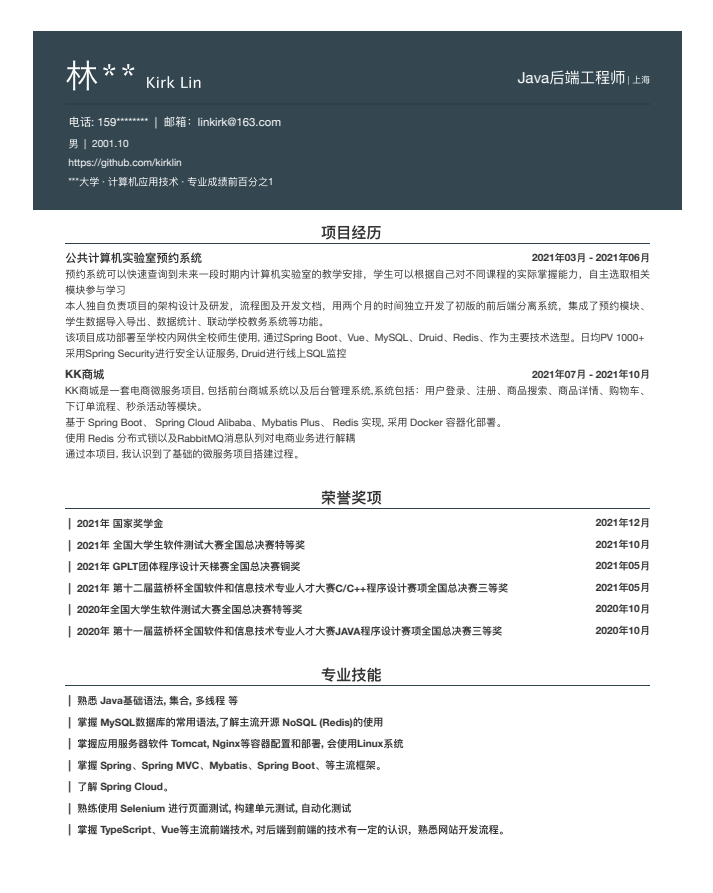

# 简历模板生成器

该项目使用 Vue 3 + Typescript + Vite 进行开发, 可以通过JSON生成简历

# 效果图

# 使用步骤

1. `npm install` 安装依赖
2. `npm run dev` 启动代码热部署
3. 修改components文件夹下Resume组件中的initData对象即可修改简历
4. 在浏览器中直接打印即可生成PDF文件

# 觉得有用记得给个Star哦
